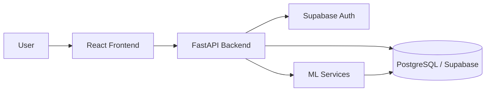
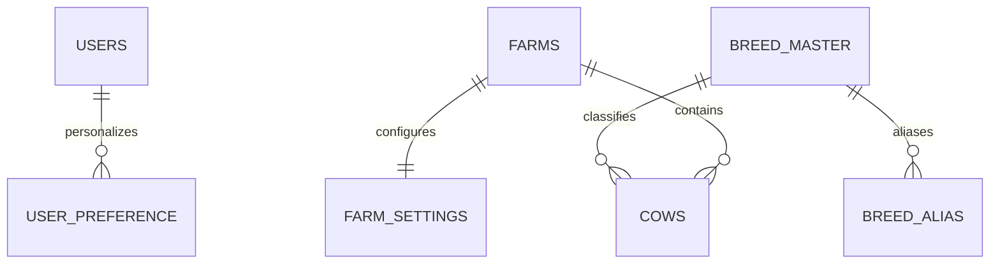

# DairyVision AI Architecture

## 1. Architectural Goals

The system is designed as a modular, cloud-friendly application with clear separation between presentation, business logic, data access, and ML services. The architecture must support future growth while staying simple enough for a focused engineering team to maintain.

## 2. System Context

## 3. Architectural Layers

### Presentation Layer

- React application with TypeScript
- Vite for local development and build pipeline
- Tailwind CSS and shadcn/ui for consistent UI
- React Router for route management
- TanStack Query for remote state and caching

### Application Layer

- FastAPI endpoints for business operations
- Pydantic models for validation and contract clarity
- Service layer for workflows such as authentication, farm management, analytics, and alerts

### Data Layer

- PostgreSQL hosted by Supabase
- SQLAlchemy ORM and Alembic migrations
- Structured persistence for users, farms, animals, operations, and analytics artifacts
- Master-data tables for breeds and aliases so the system can support Indian dairy context without duplicating free-form breed strings
- Farm-level and user-level preference tables to support localization, language, and display defaults without mixing them into transactional data

### Data Model Decisions for Sprint 2

- Breed values are treated as controlled reference data rather than free text. This prevents spelling drift, duplicate entries, and inconsistent reporting across farms.
- BreedMaster is the canonical source for breed identities. Every cow references a breed through a foreign key rather than storing a literal breed name in the cow record.
- BreedAlias stores multilingual and regional names, alternate spellings, and local terminology for the same breed. This makes the platform suitable for Hindi, regional languages, and local farm usage without changing the canonical breed record.
- FarmSettings isolates farm-level defaults such as language, currency, and display preference from the core farm identity. This keeps farm configuration explicit and easy to extend.
- UserPreference stores personal display and localization settings at the user level so each operator can view data in a preferred way without affecting other users or farms.
- The schema intentionally separates master data, operational data, and user preferences so future expansion remains maintainable and less error-prone.

### Intelligence Layer

- Python-based ML services for prediction and explainability
- XGBoost for tabular prediction
- SHAP for interpretability

## 4. Request Flow

1. A user authenticates in the frontend using Supabase Auth.
2. The frontend receives a session and stores the access token securely.
3. The frontend calls the FastAPI backend using the token in the Authorization header.
4. The backend validates the request, checks permissions, and executes the requested service.
5. The backend reads or writes data in PostgreSQL.
6. For ML features, the backend calls the model service or executes the model pipeline inline.

## 5. Authentication Design

- Supabase Auth is the identity provider.
- The backend accepts JWTs issued by Supabase or validates the session context.
- Protected routes use browser-based redirect handling plus server-side permission checks.

## 6. Deployment Architecture

- Frontend: Vercel
- Backend: Render
- Database: Supabase PostgreSQL
- Environment variables managed securely in deployment settings

## 7. Scalability and Reliability Considerations

- Stateless backend services for horizontal scaling
- Centralized config and environment separation
- Structured logging and request tracing
- Background jobs for heavy analytics where needed

## 8. Non-Functional Requirements

- Security: authentication, authorization, input validation, secret handling
- Performance: responsive UI, cached query data, efficient database access
- Reliability: graceful error handling and clear failure states
- Maintainability: modular services and documented contracts

## 9. Domain Model Sketch

