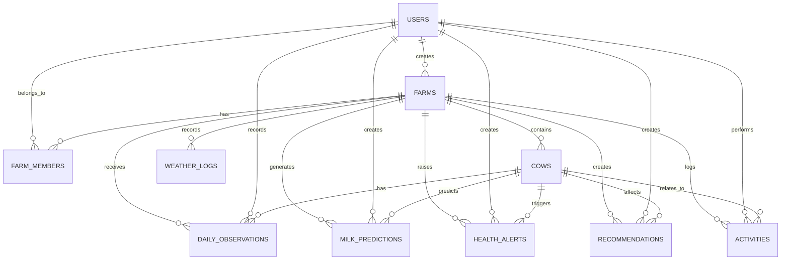

# DairyVision AI PostgreSQL Database Schema

## Overview

This schema is designed for a production-ready, scalable dairy operations platform. It supports multi-farm ownership, member access, cow lifecycle tracking, operational observations, predictive analytics, weather integration, health alerts, recommendations, and activity auditing.

## Design Principles

- Use UUID primary keys for portability and future scaling.
- Use PostgreSQL-native features such as `JSONB`, `TIMESTAMPTZ`, and `CHECK` constraints.
- Separate identity, ownership, operational data, and analytics data into clear domains.
- Include audit timestamps and soft-delete support where appropriate.
- Use explicit indexes for high-volume queries.

## Core Assumptions

- Each user may belong to multiple farms through `FarmMembers`.
- Each cow belongs to exactly one farm and one herd conceptually through a farm context.
- Observations, alerts, predictions, and activities are all tied to a farm and optionally a cow.
- Weather information is stored as time-series data and can be joined to predictions or observations.

---

## Table Specifications

### 1. Users

Purpose: Stores authenticated accounts and profile metadata.

Columns:

- `id` UUID PRIMARY KEY
- `email` VARCHAR(255) NOT NULL UNIQUE
- `full_name` VARCHAR(255) NOT NULL
- `avatar_url` TEXT NULL
- `is_active` BOOLEAN NOT NULL DEFAULT TRUE
- `is_superuser` BOOLEAN NOT NULL DEFAULT FALSE
- `created_at` TIMESTAMPTZ NOT NULL DEFAULT NOW()
- `updated_at` TIMESTAMPTZ NOT NULL DEFAULT NOW()
- `last_login_at` TIMESTAMPTZ NULL

Constraints:

- `email` must be non-empty and unique.
- `full_name` must not be empty.

Indexes:

- `idx_users_email` on `email`
- `idx_users_created_at` on `created_at`

---

### 2. Farms

Purpose: Represents a dairy farm or production unit.

Columns:

- `id` UUID PRIMARY KEY
- `name` VARCHAR(255) NOT NULL
- `description` TEXT NULL
- `location_city` VARCHAR(255) NULL
- `location_country` VARCHAR(255) NULL
- `timezone` VARCHAR(100) NOT NULL DEFAULT 'UTC'
- `is_active` BOOLEAN NOT NULL DEFAULT TRUE
- `created_at` TIMESTAMPTZ NOT NULL DEFAULT NOW()
- `updated_at` TIMESTAMPTZ NOT NULL DEFAULT NOW()
- `created_by` UUID NOT NULL REFERENCES users(id) ON DELETE RESTRICT

Constraints:

- `name` must not be empty.

Indexes:

- `idx_farms_created_by` on `created_by`
- `idx_farms_is_active` on `is_active`

---

### 3. FarmMembers

Purpose: Maps users to farms with role-based access.

Columns:

- `id` UUID PRIMARY KEY
- `farm_id` UUID NOT NULL REFERENCES farms(id) ON DELETE CASCADE
- `user_id` UUID NOT NULL REFERENCES users(id) ON DELETE CASCADE
- `role` VARCHAR(50) NOT NULL DEFAULT 'member'
- `is_active` BOOLEAN NOT NULL DEFAULT TRUE
- `invited_by` UUID NULL REFERENCES users(id) ON DELETE SET NULL
- `joined_at` TIMESTAMPTZ NOT NULL DEFAULT NOW()
- `created_at` TIMESTAMPTZ NOT NULL DEFAULT NOW()

Constraints:

- `role` must be one of `owner`, `manager`, `member`, `viewer`
- Unique pair `(farm_id, user_id)`

Indexes:

- `idx_farm_members_farm_id` on `farm_id`
- `idx_farm_members_user_id` on `user_id`
- `idx_farm_members_role` on `role`

---

### 4. Cows

Purpose: Represents the individual cows within a farm.

Columns:

- `id` UUID PRIMARY KEY
- `farm_id` UUID NOT NULL REFERENCES farms(id) ON DELETE CASCADE
- `tag_id` VARCHAR(100) NOT NULL UNIQUE
- `name` VARCHAR(255) NULL
- `breed` VARCHAR(100) NULL
- `birth_date` DATE NULL
- `sex` VARCHAR(20) NULL
- `status` VARCHAR(50) NOT NULL DEFAULT 'active'
- `weight_kg` NUMERIC(8,2) NULL
- `lactation_number` INTEGER NULL
- `notes` TEXT NULL
- `created_at` TIMESTAMPTZ NOT NULL DEFAULT NOW()
- `updated_at` TIMESTAMPTZ NOT NULL DEFAULT NOW()
- `created_by` UUID NULL REFERENCES users(id) ON DELETE SET NULL

Constraints:

- `status` must be one of `active`, `dry`, `sick`, `deceased`, `sold`
- `lactation_number` must be positive if present
- `weight_kg` must be positive if present

Indexes:

- `idx_cows_farm_id` on `farm_id`
- `idx_cows_status` on `status`
- `idx_cows_created_by` on `created_by`
- `idx_cows_tag_id` on `tag_id`

---

### 5. DailyObservations

Purpose: Stores daily operational and health observations for cows or farms.

Columns:

- `id` UUID PRIMARY KEY
- `farm_id` UUID NOT NULL REFERENCES farms(id) ON DELETE CASCADE
- `cow_id` UUID NULL REFERENCES cows(id) ON DELETE SET NULL
- `observation_date` DATE NOT NULL
- `observation_type` VARCHAR(50) NOT NULL
- `severity` VARCHAR(20) NULL
- `temperature_c` NUMERIC(5,2) NULL
- `heart_rate` NUMERIC(5,2) NULL
- `respiration_rate` NUMERIC(5,2) NULL
- `milk_yield_kg` NUMERIC(8,2) NULL
- `feed_intake_kg` NUMERIC(8,2) NULL
- `body_condition_score` NUMERIC(3,1) NULL
- `notes` TEXT NULL
- `recorded_by` UUID NULL REFERENCES users(id) ON DELETE SET NULL
- `created_at` TIMESTAMPTZ NOT NULL DEFAULT NOW()
- `updated_at` TIMESTAMPTZ NOT NULL DEFAULT NOW()

Constraints:

- `observation_type` must not be empty
- `severity` if present must be one of `low`, `medium`, `high`, `critical`
- `milk_yield_kg` must be non-negative if present
- `feed_intake_kg` must be non-negative if present

Indexes:

- `idx_daily_observations_farm_id` on `farm_id`
- `idx_daily_observations_cow_id` on `cow_id`
- `idx_daily_observations_date` on `observation_date`
- `idx_daily_observations_type` on `observation_type`

---

### 6. MilkPredictions

Purpose: Stores ML predictions for milk yield or related outputs.

Columns:

- `id` UUID PRIMARY KEY
- `farm_id` UUID NOT NULL REFERENCES farms(id) ON DELETE CASCADE
- `cow_id` UUID NULL REFERENCES cows(id) ON DELETE SET NULL
- `prediction_date` DATE NOT NULL
- `model_name` VARCHAR(100) NOT NULL
- `prediction_type` VARCHAR(50) NOT NULL DEFAULT 'milk_yield'
- `predicted_value` NUMERIC(10,3) NOT NULL
- `lower_bound` NUMERIC(10,3) NULL
- `upper_bound` NUMERIC(10,3) NULL
- `confidence_score` NUMERIC(5,4) NULL
- `feature_snapshot` JSONB NULL
- `created_at` TIMESTAMPTZ NOT NULL DEFAULT NOW()
- `created_by` UUID NULL REFERENCES users(id) ON DELETE SET NULL

Constraints:

- `predicted_value` must be non-negative
- `confidence_score` must be between 0 and 1 if present

Indexes:

- `idx_milk_predictions_farm_id` on `farm_id`
- `idx_milk_predictions_cow_id` on `cow_id`
- `idx_milk_predictions_date` on `prediction_date`
- `idx_milk_predictions_model_name` on `model_name`

---

### 7. WeatherLogs

Purpose: Stores weather observations or forecasts used in prediction and analytics contexts.

Columns:

- `id` UUID PRIMARY KEY
- `farm_id` UUID NOT NULL REFERENCES farms(id) ON DELETE CASCADE
- `source` VARCHAR(100) NOT NULL DEFAULT 'external_api'
- `recorded_at` TIMESTAMPTZ NOT NULL
- `temperature_c` NUMERIC(6,2) NULL
- `humidity_pct` NUMERIC(5,2) NULL
- `wind_speed_kmh` NUMERIC(6,2) NULL
- `precipitation_mm` NUMERIC(6,2) NULL
- `weather_code` VARCHAR(50) NULL
- `metadata` JSONB NULL
- `created_at` TIMESTAMPTZ NOT NULL DEFAULT NOW()

Constraints:

- `humidity_pct` between 0 and 100 if present
- `temperature_c` may be any numeric range but should be validated downstream

Indexes:

- `idx_weather_logs_farm_id` on `farm_id`
- `idx_weather_logs_recorded_at` on `recorded_at`
- `idx_weather_logs_source` on `source`

---

### 8. HealthAlerts

Purpose: Stores alerts derived from observations or rules.

Columns:

- `id` UUID PRIMARY KEY
- `farm_id` UUID NOT NULL REFERENCES farms(id) ON DELETE CASCADE
- `cow_id` UUID NULL REFERENCES cows(id) ON DELETE SET NULL
- `alert_type` VARCHAR(50) NOT NULL
- `severity` VARCHAR(20) NOT NULL
- `title` VARCHAR(255) NOT NULL
- `description` TEXT NULL
- `status` VARCHAR(20) NOT NULL DEFAULT 'open'
- `detected_at` TIMESTAMPTZ NOT NULL DEFAULT NOW()
- `resolved_at` TIMESTAMPTZ NULL
- `created_by` UUID NULL REFERENCES users(id) ON DELETE SET NULL

Constraints:

- `severity` one of `low`, `medium`, `high`, `critical`
- `status` one of `open`, `acknowledged`, `resolved`, `dismissed`

Indexes:

- `idx_health_alerts_farm_id` on `farm_id`
- `idx_health_alerts_cow_id` on `cow_id`
- `idx_health_alerts_status` on `status`
- `idx_health_alerts_detected_at` on `detected_at`

---

### 9. Recommendations

Purpose: Stores suggestions generated for farm users.

Columns:

- `id` UUID PRIMARY KEY
- `farm_id` UUID NOT NULL REFERENCES farms(id) ON DELETE CASCADE
- `cow_id` UUID NULL REFERENCES cows(id) ON DELETE SET NULL
- `recommendation_type` VARCHAR(50) NOT NULL
- `priority` VARCHAR(20) NOT NULL DEFAULT 'medium'
- `title` VARCHAR(255) NOT NULL
- `description` TEXT NOT NULL
- `is_active` BOOLEAN NOT NULL DEFAULT TRUE
- `created_at` TIMESTAMPTZ NOT NULL DEFAULT NOW()
- `created_by` UUID NULL REFERENCES users(id) ON DELETE SET NULL

Constraints:

- `priority` one of `low`, `medium`, `high`, `critical`

Indexes:

- `idx_recommendations_farm_id` on `farm_id`
- `idx_recommendations_cow_id` on `cow_id`
- `idx_recommendations_priority` on `priority`
- `idx_recommendations_is_active` on `is_active`

---

### 10. Activities

Purpose: Stores an immutable audit trail of user and system actions.

Columns:

- `id` UUID PRIMARY KEY
- `farm_id` UUID NULL REFERENCES farms(id) ON DELETE SET NULL
- `user_id` UUID NULL REFERENCES users(id) ON DELETE SET NULL
- `cow_id` UUID NULL REFERENCES cows(id) ON DELETE SET NULL
- `activity_type` VARCHAR(100) NOT NULL
- `description` TEXT NOT NULL
- `metadata` JSONB NULL
- `created_at` TIMESTAMPTZ NOT NULL DEFAULT NOW()

Constraints:

- `activity_type` must not be empty

Indexes:

- `idx_activities_farm_id` on `farm_id`
- `idx_activities_user_id` on `user_id`
- `idx_activities_cow_id` on `cow_id`
- `idx_activities_created_at` on `created_at`

---

## PostgreSQL CREATE TABLE Statements

```sql
CREATE EXTENSION IF NOT EXISTS "uuid-ossp";

CREATE TABLE users (
    id UUID PRIMARY KEY DEFAULT gen_random_uuid(),
    email VARCHAR(255) NOT NULL UNIQUE,
    full_name VARCHAR(255) NOT NULL,
    avatar_url TEXT NULL,
    is_active BOOLEAN NOT NULL DEFAULT TRUE,
    is_superuser BOOLEAN NOT NULL DEFAULT FALSE,
    created_at TIMESTAMPTZ NOT NULL DEFAULT NOW(),
    updated_at TIMESTAMPTZ NOT NULL DEFAULT NOW(),
    last_login_at TIMESTAMPTZ NULL,
    CHECK (email <> ''),
    CHECK (full_name <> '')
);

CREATE TABLE farms (
    id UUID PRIMARY KEY DEFAULT gen_random_uuid(),
    name VARCHAR(255) NOT NULL,
    description TEXT NULL,
    location_city VARCHAR(255) NULL,
    location_country VARCHAR(255) NULL,
    timezone VARCHAR(100) NOT NULL DEFAULT 'UTC',
    is_active BOOLEAN NOT NULL DEFAULT TRUE,
    created_at TIMESTAMPTZ NOT NULL DEFAULT NOW(),
    updated_at TIMESTAMPTZ NOT NULL DEFAULT NOW(),
    created_by UUID NOT NULL REFERENCES users(id) ON DELETE RESTRICT,
    CHECK (name <> '')
);

CREATE TABLE farm_members (
    id UUID PRIMARY KEY DEFAULT gen_random_uuid(),
    farm_id UUID NOT NULL REFERENCES farms(id) ON DELETE CASCADE,
    user_id UUID NOT NULL REFERENCES users(id) ON DELETE CASCADE,
    role VARCHAR(50) NOT NULL DEFAULT 'member',
    is_active BOOLEAN NOT NULL DEFAULT TRUE,
    invited_by UUID NULL REFERENCES users(id) ON DELETE SET NULL,
    joined_at TIMESTAMPTZ NOT NULL DEFAULT NOW(),
    created_at TIMESTAMPTZ NOT NULL DEFAULT NOW(),
    UNIQUE (farm_id, user_id),
    CHECK (role IN ('owner', 'manager', 'member', 'viewer'))
);

CREATE TABLE cows (
    id UUID PRIMARY KEY DEFAULT gen_random_uuid(),
    farm_id UUID NOT NULL REFERENCES farms(id) ON DELETE CASCADE,
    tag_id VARCHAR(100) NOT NULL UNIQUE,
    name VARCHAR(255) NULL,
    breed VARCHAR(100) NULL,
    birth_date DATE NULL,
    sex VARCHAR(20) NULL,
    status VARCHAR(50) NOT NULL DEFAULT 'active',
    weight_kg NUMERIC(8,2) NULL,
    lactation_number INTEGER NULL,
    notes TEXT NULL,
    created_at TIMESTAMPTZ NOT NULL DEFAULT NOW(),
    updated_at TIMESTAMPTZ NOT NULL DEFAULT NOW(),
    created_by UUID NULL REFERENCES users(id) ON DELETE SET NULL,
    CHECK (status IN ('active', 'dry', 'sick', 'deceased', 'sold')),
    CHECK (lactation_number IS NULL OR lactation_number > 0),
    CHECK (weight_kg IS NULL OR weight_kg > 0)
);

CREATE TABLE daily_observations (
    id UUID PRIMARY KEY DEFAULT gen_random_uuid(),
    farm_id UUID NOT NULL REFERENCES farms(id) ON DELETE CASCADE,
    cow_id UUID NULL REFERENCES cows(id) ON DELETE SET NULL,
    observation_date DATE NOT NULL,
    observation_type VARCHAR(50) NOT NULL,
    severity VARCHAR(20) NULL,
    temperature_c NUMERIC(5,2) NULL,
    heart_rate NUMERIC(5,2) NULL,
    respiration_rate NUMERIC(5,2) NULL,
    milk_yield_kg NUMERIC(8,2) NULL,
    feed_intake_kg NUMERIC(8,2) NULL,
    body_condition_score NUMERIC(3,1) NULL,
    notes TEXT NULL,
    recorded_by UUID NULL REFERENCES users(id) ON DELETE SET NULL,
    created_at TIMESTAMPTZ NOT NULL DEFAULT NOW(),
    updated_at TIMESTAMPTZ NOT NULL DEFAULT NOW(),
    CHECK (severity IS NULL OR severity IN ('low', 'medium', 'high', 'critical')),
    CHECK (milk_yield_kg IS NULL OR milk_yield_kg >= 0),
    CHECK (feed_intake_kg IS NULL OR feed_intake_kg >= 0)
);

CREATE TABLE milk_predictions (
    id UUID PRIMARY KEY DEFAULT gen_random_uuid(),
    farm_id UUID NOT NULL REFERENCES farms(id) ON DELETE CASCADE,
    cow_id UUID NULL REFERENCES cows(id) ON DELETE SET NULL,
    prediction_date DATE NOT NULL,
    model_name VARCHAR(100) NOT NULL,
    prediction_type VARCHAR(50) NOT NULL DEFAULT 'milk_yield',
    predicted_value NUMERIC(10,3) NOT NULL,
    lower_bound NUMERIC(10,3) NULL,
    upper_bound NUMERIC(10,3) NULL,
    confidence_score NUMERIC(5,4) NULL,
    feature_snapshot JSONB NULL,
    created_at TIMESTAMPTZ NOT NULL DEFAULT NOW(),
    created_by UUID NULL REFERENCES users(id) ON DELETE SET NULL,
    CHECK (predicted_value >= 0),
    CHECK (confidence_score IS NULL OR (confidence_score >= 0 AND confidence_score <= 1))
);

CREATE TABLE weather_logs (
    id UUID PRIMARY KEY DEFAULT gen_random_uuid(),
    farm_id UUID NOT NULL REFERENCES farms(id) ON DELETE CASCADE,
    source VARCHAR(100) NOT NULL DEFAULT 'external_api',
    recorded_at TIMESTAMPTZ NOT NULL,
    temperature_c NUMERIC(6,2) NULL,
    humidity_pct NUMERIC(5,2) NULL,
    wind_speed_kmh NUMERIC(6,2) NULL,
    precipitation_mm NUMERIC(6,2) NULL,
    weather_code VARCHAR(50) NULL,
    metadata JSONB NULL,
    created_at TIMESTAMPTZ NOT NULL DEFAULT NOW(),
    CHECK (humidity_pct IS NULL OR (humidity_pct >= 0 AND humidity_pct <= 100))
);

CREATE TABLE health_alerts (
    id UUID PRIMARY KEY DEFAULT gen_random_uuid(),
    farm_id UUID NOT NULL REFERENCES farms(id) ON DELETE CASCADE,
    cow_id UUID NULL REFERENCES cows(id) ON DELETE SET NULL,
    alert_type VARCHAR(50) NOT NULL,
    severity VARCHAR(20) NOT NULL,
    title VARCHAR(255) NOT NULL,
    description TEXT NULL,
    status VARCHAR(20) NOT NULL DEFAULT 'open',
    detected_at TIMESTAMPTZ NOT NULL DEFAULT NOW(),
    resolved_at TIMESTAMPTZ NULL,
    created_by UUID NULL REFERENCES users(id) ON DELETE SET NULL,
    CHECK (severity IN ('low', 'medium', 'high', 'critical')),
    CHECK (status IN ('open', 'acknowledged', 'resolved', 'dismissed'))
);

CREATE TABLE recommendations (
    id UUID PRIMARY KEY DEFAULT gen_random_uuid(),
    farm_id UUID NOT NULL REFERENCES farms(id) ON DELETE CASCADE,
    cow_id UUID NULL REFERENCES cows(id) ON DELETE SET NULL,
    recommendation_type VARCHAR(50) NOT NULL,
    priority VARCHAR(20) NOT NULL DEFAULT 'medium',
    title VARCHAR(255) NOT NULL,
    description TEXT NOT NULL,
    is_active BOOLEAN NOT NULL DEFAULT TRUE,
    created_at TIMESTAMPTZ NOT NULL DEFAULT NOW(),
    created_by UUID NULL REFERENCES users(id) ON DELETE SET NULL,
    CHECK (priority IN ('low', 'medium', 'high', 'critical'))
);

CREATE TABLE activities (
    id UUID PRIMARY KEY DEFAULT gen_random_uuid(),
    farm_id UUID NULL REFERENCES farms(id) ON DELETE SET NULL,
    user_id UUID NULL REFERENCES users(id) ON DELETE SET NULL,
    cow_id UUID NULL REFERENCES cows(id) ON DELETE SET NULL,
    activity_type VARCHAR(100) NOT NULL,
    description TEXT NOT NULL,
    metadata JSONB NULL,
    created_at TIMESTAMPTZ NOT NULL DEFAULT NOW(),
    CHECK (activity_type <> '')
);
```

---

## Indexes

```sql
CREATE INDEX idx_users_email ON users (email);
CREATE INDEX idx_users_created_at ON users (created_at);

CREATE INDEX idx_farms_created_by ON farms (created_by);
CREATE INDEX idx_farms_is_active ON farms (is_active);

CREATE INDEX idx_farm_members_farm_id ON farm_members (farm_id);
CREATE INDEX idx_farm_members_user_id ON farm_members (user_id);
CREATE INDEX idx_farm_members_role ON farm_members (role);

CREATE INDEX idx_cows_farm_id ON cows (farm_id);
CREATE INDEX idx_cows_status ON cows (status);
CREATE INDEX idx_cows_tag_id ON cows (tag_id);

CREATE INDEX idx_daily_observations_farm_id ON daily_observations (farm_id);
CREATE INDEX idx_daily_observations_cow_id ON daily_observations (cow_id);
CREATE INDEX idx_daily_observations_date ON daily_observations (observation_date);
CREATE INDEX idx_daily_observations_type ON daily_observations (observation_type);

CREATE INDEX idx_milk_predictions_farm_id ON milk_predictions (farm_id);
CREATE INDEX idx_milk_predictions_cow_id ON milk_predictions (cow_id);
CREATE INDEX idx_milk_predictions_date ON milk_predictions (prediction_date);
CREATE INDEX idx_milk_predictions_model_name ON milk_predictions (model_name);

CREATE INDEX idx_weather_logs_farm_id ON weather_logs (farm_id);
CREATE INDEX idx_weather_logs_recorded_at ON weather_logs (recorded_at);
CREATE INDEX idx_weather_logs_source ON weather_logs (source);

CREATE INDEX idx_health_alerts_farm_id ON health_alerts (farm_id);
CREATE INDEX idx_health_alerts_cow_id ON health_alerts (cow_id);
CREATE INDEX idx_health_alerts_status ON health_alerts (status);
CREATE INDEX idx_health_alerts_detected_at ON health_alerts (detected_at);

CREATE INDEX idx_recommendations_farm_id ON recommendations (farm_id);
CREATE INDEX idx_recommendations_cow_id ON recommendations (cow_id);
CREATE INDEX idx_recommendations_priority ON recommendations (priority);
CREATE INDEX idx_recommendations_is_active ON recommendations (is_active);

CREATE INDEX idx_activities_farm_id ON activities (farm_id);
CREATE INDEX idx_activities_user_id ON activities (user_id);
CREATE INDEX idx_activities_cow_id ON activities (cow_id);
CREATE INDEX idx_activities_created_at ON activities (created_at);
```

---

## SQLAlchemy Models

```python
from datetime import date, datetime
from typing import Optional
from uuid import uuid4

from sqlalchemy import (
    Boolean,
    CheckConstraint,
    Date,
    DateTime,
    ForeignKey,
    Index,
    Integer,
    Numeric,
    String,
    Text,
    JSON,
    UUID,
    func,
)
from sqlalchemy.orm import DeclarativeBase, Mapped, mapped_column, relationship


class Base(DeclarativeBase):
    pass


class User(Base):
    __tablename__ = "users"

    id: Mapped[str] = mapped_column(UUID(as_uuid=False), primary_key=True, default=lambda: str(uuid4()))
    email: Mapped[str] = mapped_column(String(255), unique=True, nullable=False)
    full_name: Mapped[str] = mapped_column(String(255), nullable=False)
    avatar_url: Mapped[Optional[str]] = mapped_column(Text, nullable=True)
    is_active: Mapped[bool] = mapped_column(Boolean, nullable=False, default=True)
    is_superuser: Mapped[bool] = mapped_column(Boolean, nullable=False, default=False)
    created_at: Mapped[datetime] = mapped_column(DateTime(timezone=True), nullable=False, server_default=func.now())
    updated_at: Mapped[datetime] = mapped_column(DateTime(timezone=True), nullable=False, server_default=func.now(), onupdate=func.now())
    last_login_at: Mapped[Optional[datetime]] = mapped_column(DateTime(timezone=True), nullable=True)


class Farm(Base):
    __tablename__ = "farms"

    id: Mapped[str] = mapped_column(UUID(as_uuid=False), primary_key=True, default=lambda: str(uuid4()))
    name: Mapped[str] = mapped_column(String(255), nullable=False)
    description: Mapped[Optional[str]] = mapped_column(Text, nullable=True)
    location_city: Mapped[Optional[str]] = mapped_column(String(255), nullable=True)
    location_country: Mapped[Optional[str]] = mapped_column(String(255), nullable=True)
    timezone: Mapped[str] = mapped_column(String(100), nullable=False, default="UTC")
    is_active: Mapped[bool] = mapped_column(Boolean, nullable=False, default=True)
    created_at: Mapped[datetime] = mapped_column(DateTime(timezone=True), nullable=False, server_default=func.now())
    updated_at: Mapped[datetime] = mapped_column(DateTime(timezone=True), nullable=False, server_default=func.now(), onupdate=func.now())
    created_by: Mapped[str] = mapped_column(UUID(as_uuid=False), ForeignKey("users.id", ondelete="RESTRICT"), nullable=False)


class FarmMember(Base):
    __tablename__ = "farm_members"

    id: Mapped[str] = mapped_column(UUID(as_uuid=False), primary_key=True, default=lambda: str(uuid4()))
    farm_id: Mapped[str] = mapped_column(UUID(as_uuid=False), ForeignKey("farms.id", ondelete="CASCADE"), nullable=False)
    user_id: Mapped[str] = mapped_column(UUID(as_uuid=False), ForeignKey("users.id", ondelete="CASCADE"), nullable=False)
    role: Mapped[str] = mapped_column(String(50), nullable=False, default="member")
    is_active: Mapped[bool] = mapped_column(Boolean, nullable=False, default=True)
    invited_by: Mapped[Optional[str]] = mapped_column(UUID(as_uuid=False), ForeignKey("users.id", ondelete="SET NULL"), nullable=True)
    joined_at: Mapped[datetime] = mapped_column(DateTime(timezone=True), nullable=False, server_default=func.now())
    created_at: Mapped[datetime] = mapped_column(DateTime(timezone=True), nullable=False, server_default=func.now())

    __table_args__ = (
        CheckConstraint("role IN ('owner', 'manager', 'member', 'viewer')", name="ck_farm_member_role"),
        UniqueConstraint("farm_id", "user_id", name="uq_farm_member_pair"),
    )


class Cow(Base):
    __tablename__ = "cows"

    id: Mapped[str] = mapped_column(UUID(as_uuid=False), primary_key=True, default=lambda: str(uuid4()))
    farm_id: Mapped[str] = mapped_column(UUID(as_uuid=False), ForeignKey("farms.id", ondelete="CASCADE"), nullable=False)
    tag_id: Mapped[str] = mapped_column(String(100), nullable=False, unique=True)
    name: Mapped[Optional[str]] = mapped_column(String(255), nullable=True)
    breed: Mapped[Optional[str]] = mapped_column(String(100), nullable=True)
    birth_date: Mapped[Optional[date]] = mapped_column(Date, nullable=True)
    sex: Mapped[Optional[str]] = mapped_column(String(20), nullable=True)
    status: Mapped[str] = mapped_column(String(50), nullable=False, default="active")
    weight_kg: Mapped[Optional[float]] = mapped_column(Numeric(8, 2), nullable=True)
    lactation_number: Mapped[Optional[int]] = mapped_column(Integer, nullable=True)
    notes: Mapped[Optional[str]] = mapped_column(Text, nullable=True)
    created_at: Mapped[datetime] = mapped_column(DateTime(timezone=True), nullable=False, server_default=func.now())
    updated_at: Mapped[datetime] = mapped_column(DateTime(timezone=True), nullable=False, server_default=func.now(), onupdate=func.now())
    created_by: Mapped[Optional[str]] = mapped_column(UUID(as_uuid=False), ForeignKey("users.id", ondelete="SET NULL"), nullable=True)

    __table_args__ = (
        CheckConstraint("status IN ('active', 'dry', 'sick', 'deceased', 'sold')", name="ck_cow_status"),
        CheckConstraint("lactation_number IS NULL OR lactation_number > 0", name="ck_cow_lactation"),
        CheckConstraint("weight_kg IS NULL OR weight_kg > 0", name="ck_cow_weight"),
    )


class DailyObservation(Base):
    __tablename__ = "daily_observations"

    id: Mapped[str] = mapped_column(UUID(as_uuid=False), primary_key=True, default=lambda: str(uuid4()))
    farm_id: Mapped[str] = mapped_column(UUID(as_uuid=False), ForeignKey("farms.id", ondelete="CASCADE"), nullable=False)
    cow_id: Mapped[Optional[str]] = mapped_column(UUID(as_uuid=False), ForeignKey("cows.id", ondelete="SET NULL"), nullable=True)
    observation_date: Mapped[date] = mapped_column(Date, nullable=False)
    observation_type: Mapped[str] = mapped_column(String(50), nullable=False)
    severity: Mapped[Optional[str]] = mapped_column(String(20), nullable=True)
    temperature_c: Mapped[Optional[float]] = mapped_column(Numeric(5, 2), nullable=True)
    heart_rate: Mapped[Optional[float]] = mapped_column(Numeric(5, 2), nullable=True)
    respiration_rate: Mapped[Optional[float]] = mapped_column(Numeric(5, 2), nullable=True)
    milk_yield_kg: Mapped[Optional[float]] = mapped_column(Numeric(8, 2), nullable=True)
    feed_intake_kg: Mapped[Optional[float]] = mapped_column(Numeric(8, 2), nullable=True)
    body_condition_score: Mapped[Optional[float]] = mapped_column(Numeric(3, 1), nullable=True)
    notes: Mapped[Optional[str]] = mapped_column(Text, nullable=True)
    recorded_by: Mapped[Optional[str]] = mapped_column(UUID(as_uuid=False), ForeignKey("users.id", ondelete="SET NULL"), nullable=True)
    created_at: Mapped[datetime] = mapped_column(DateTime(timezone=True), nullable=False, server_default=func.now())
    updated_at: Mapped[datetime] = mapped_column(DateTime(timezone=True), nullable=False, server_default=func.now(), onupdate=func.now())

    __table_args__ = (
        CheckConstraint("severity IS NULL OR severity IN ('low', 'medium', 'high', 'critical')", name="ck_observation_severity"),
        CheckConstraint("milk_yield_kg IS NULL OR milk_yield_kg >= 0", name="ck_observation_milk_yield"),
        CheckConstraint("feed_intake_kg IS NULL OR feed_intake_kg >= 0", name="ck_observation_feed_intake"),
    )


class MilkPrediction(Base):
    __tablename__ = "milk_predictions"

    id: Mapped[str] = mapped_column(UUID(as_uuid=False), primary_key=True, default=lambda: str(uuid4()))
    farm_id: Mapped[str] = mapped_column(UUID(as_uuid=False), ForeignKey("farms.id", ondelete="CASCADE"), nullable=False)
    cow_id: Mapped[Optional[str]] = mapped_column(UUID(as_uuid=False), ForeignKey("cows.id", ondelete="SET NULL"), nullable=True)
    prediction_date: Mapped[date] = mapped_column(Date, nullable=False)
    model_name: Mapped[str] = mapped_column(String(100), nullable=False)
    prediction_type: Mapped[str] = mapped_column(String(50), nullable=False, default="milk_yield")
    predicted_value: Mapped[float] = mapped_column(Numeric(10, 3), nullable=False)
    lower_bound: Mapped[Optional[float]] = mapped_column(Numeric(10, 3), nullable=True)
    upper_bound: Mapped[Optional[float]] = mapped_column(Numeric(10, 3), nullable=True)
    confidence_score: Mapped[Optional[float]] = mapped_column(Numeric(5, 4), nullable=True)
    feature_snapshot: Mapped[Optional[dict]] = mapped_column(JSON, nullable=True)
    created_at: Mapped[datetime] = mapped_column(DateTime(timezone=True), nullable=False, server_default=func.now())
    created_by: Mapped[Optional[str]] = mapped_column(UUID(as_uuid=False), ForeignKey("users.id", ondelete="SET NULL"), nullable=True)

    __table_args__ = (
        CheckConstraint("predicted_value >= 0", name="ck_prediction_value"),
        CheckConstraint("confidence_score IS NULL OR (confidence_score >= 0 AND confidence_score <= 1)", name="ck_prediction_confidence"),
    )


class WeatherLog(Base):
    __tablename__ = "weather_logs"

    id: Mapped[str] = mapped_column(UUID(as_uuid=False), primary_key=True, default=lambda: str(uuid4()))
    farm_id: Mapped[str] = mapped_column(UUID(as_uuid=False), ForeignKey("farms.id", ondelete="CASCADE"), nullable=False)
    source: Mapped[str] = mapped_column(String(100), nullable=False, default="external_api")
    recorded_at: Mapped[datetime] = mapped_column(DateTime(timezone=True), nullable=False)
    temperature_c: Mapped[Optional[float]] = mapped_column(Numeric(6, 2), nullable=True)
    humidity_pct: Mapped[Optional[float]] = mapped_column(Numeric(5, 2), nullable=True)
    wind_speed_kmh: Mapped[Optional[float]] = mapped_column(Numeric(6, 2), nullable=True)
    precipitation_mm: Mapped[Optional[float]] = mapped_column(Numeric(6, 2), nullable=True)
    weather_code: Mapped[Optional[str]] = mapped_column(String(50), nullable=True)
    metadata: Mapped[Optional[dict]] = mapped_column(JSON, nullable=True)
    created_at: Mapped[datetime] = mapped_column(DateTime(timezone=True), nullable=False, server_default=func.now())

    __table_args__ = (
        CheckConstraint("humidity_pct IS NULL OR (humidity_pct >= 0 AND humidity_pct <= 100)", name="ck_weather_humidity"),
    )


class HealthAlert(Base):
    __tablename__ = "health_alerts"

    id: Mapped[str] = mapped_column(UUID(as_uuid=False), primary_key=True, default=lambda: str(uuid4()))
    farm_id: Mapped[str] = mapped_column(UUID(as_uuid=False), ForeignKey("farms.id", ondelete="CASCADE"), nullable=False)
    cow_id: Mapped[Optional[str]] = mapped_column(UUID(as_uuid=False), ForeignKey("cows.id", ondelete="SET NULL"), nullable=True)
    alert_type: Mapped[str] = mapped_column(String(50), nullable=False)
    severity: Mapped[str] = mapped_column(String(20), nullable=False)
    title: Mapped[str] = mapped_column(String(255), nullable=False)
    description: Mapped[Optional[str]] = mapped_column(Text, nullable=True)
    status: Mapped[str] = mapped_column(String(20), nullable=False, default="open")
    detected_at: Mapped[datetime] = mapped_column(DateTime(timezone=True), nullable=False, server_default=func.now())
    resolved_at: Mapped[Optional[datetime]] = mapped_column(DateTime(timezone=True), nullable=True)
    created_by: Mapped[Optional[str]] = mapped_column(UUID(as_uuid=False), ForeignKey("users.id", ondelete="SET NULL"), nullable=True)

    __table_args__ = (
        CheckConstraint("severity IN ('low', 'medium', 'high', 'critical')", name="ck_health_alert_severity"),
        CheckConstraint("status IN ('open', 'acknowledged', 'resolved', 'dismissed')", name="ck_health_alert_status"),
    )


class Recommendation(Base):
    __tablename__ = "recommendations"

    id: Mapped[str] = mapped_column(UUID(as_uuid=False), primary_key=True, default=lambda: str(uuid4()))
    farm_id: Mapped[str] = mapped_column(UUID(as_uuid=False), ForeignKey("farms.id", ondelete="CASCADE"), nullable=False)
    cow_id: Mapped[Optional[str]] = mapped_column(UUID(as_uuid=False), ForeignKey("cows.id", ondelete="SET NULL"), nullable=True)
    recommendation_type: Mapped[str] = mapped_column(String(50), nullable=False)
    priority: Mapped[str] = mapped_column(String(20), nullable=False, default="medium")
    title: Mapped[str] = mapped_column(String(255), nullable=False)
    description: Mapped[str] = mapped_column(Text, nullable=False)
    is_active: Mapped[bool] = mapped_column(Boolean, nullable=False, default=True)
    created_at: Mapped[datetime] = mapped_column(DateTime(timezone=True), nullable=False, server_default=func.now())
    created_by: Mapped[Optional[str]] = mapped_column(UUID(as_uuid=False), ForeignKey("users.id", ondelete="SET NULL"), nullable=True)

    __table_args__ = (
        CheckConstraint("priority IN ('low', 'medium', 'high', 'critical')", name="ck_recommendation_priority"),
    )


class Activity(Base):
    __tablename__ = "activities"

    id: Mapped[str] = mapped_column(UUID(as_uuid=False), primary_key=True, default=lambda: str(uuid4()))
    farm_id: Mapped[Optional[str]] = mapped_column(UUID(as_uuid=False), ForeignKey("farms.id", ondelete="SET NULL"), nullable=True)
    user_id: Mapped[Optional[str]] = mapped_column(UUID(as_uuid=False), ForeignKey("users.id", ondelete="SET NULL"), nullable=True)
    cow_id: Mapped[Optional[str]] = mapped_column(UUID(as_uuid=False), ForeignKey("cows.id", ondelete="SET NULL"), nullable=True)
    activity_type: Mapped[str] = mapped_column(String(100), nullable=False)
    description: Mapped[str] = mapped_column(Text, nullable=False)
    metadata: Mapped[Optional[dict]] = mapped_column(JSON, nullable=True)
    created_at: Mapped[datetime] = mapped_column(DateTime(timezone=True), nullable=False, server_default=func.now())
```

---

## Mermaid ER Diagram



---

## Relationship Explanation

- `Users` are global accounts that may access one or more farms through `FarmMembers`.
- `Farms` own the operational and analytics context for the platform.
- `FarmMembers` provides role-based access control for each farm.
- `Cows` belong to a single farm and can accumulate many observations and alerts.
- `DailyObservations` are the primary operational records, often linked to a specific cow.
- `MilkPredictions` are analytics outputs tied to cows or farms and support forecasting workflows.
- `WeatherLogs` capture environmental context relevant to predictions and anomalies.
- `HealthAlerts` represent issues detected from rule-based systems or AI inference.
- `Recommendations` store actionable guidance and can be attached to specific cows or farms.
- `Activities` is a general-purpose audit trail for operational events and a scalable logging mechanism.

## Scalability Notes

- Use partitioning in the future for very large observation and weather datasets.
- Consider materialized views for dashboard analytics.
- Keep the schema normalized while allowing JSONB for evolving metadata fields.
- Introduce soft-delete patterns if operational workflows require record history preservation.
